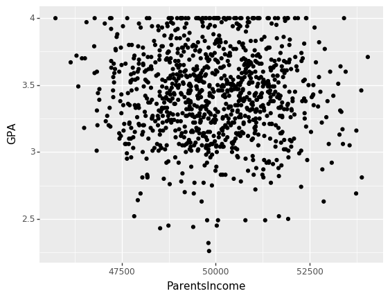
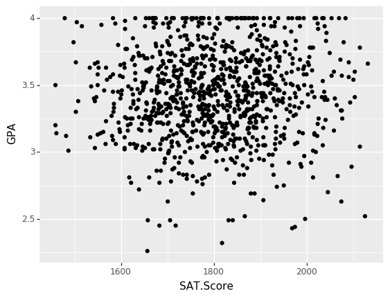
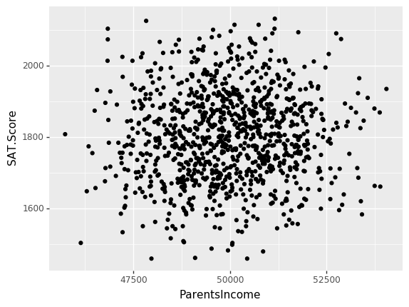

# HW2
Using the gpa data from the Data folder on GitHub (gpa.csv), build a predictive linear regression model using the sklearn package.


```python
import warnings
warnings.filterwarnings('ignore')


import pandas as pd
import numpy as np
from plotnine import *
import statsmodels.api as sm

from sklearn.linear_model import LinearRegression # Linear Regression Model
from sklearn.preprocessing import StandardScaler #Z-score variables
from sklearn.metrics import mean_squared_error, r2_score #model evaluation

from sklearn.model_selection import train_test_split # simple TT split cv
from sklearn.model_selection import KFold # k-fold cv
from sklearn.model_selection import LeaveOneOut #LOO cv
from sklearn.model_selection import cross_val_score # cross validation metrics
from sklearn.model_selection import cross_val_predict # cross validation metrics

%matplotlib inline
```

## 1
Use plotnine to explore the data (what patterns do you see in the data? Are any of them surprising?)

- GPA is the grade point average of a student
- ParentsIncome is the income of the student's family
- SAT.Math, SAT.Reading, and SAT.Writing are the student's SAT scores
- PeanutAllergy is a binary variable indicating whether the student has (1) or does not have (0) a peanut allergy.


```python
# Explore
#---YOUR CODE HERE------------------------

gpa = pd.read_csv('data/gpa.csv')

gpa.info()
gpa.isnull().sum()


#---/YOUR CODE HERE-----------------------
```

    <class 'pandas.core.frame.DataFrame'>
    RangeIndex: 1000 entries, 0 to 999
    Data columns (total 7 columns):
    Unnamed: 0       1000 non-null int64
    GPA              1000 non-null float64
    ParentsIncome    1000 non-null float64
    SAT.Math         1000 non-null int64
    SAT.Reading      1000 non-null int64
    SAT.Writing      1000 non-null int64
    PeanutAllergy    1000 non-null int64
    dtypes: float64(2), int64(5)
    memory usage: 54.8 KB
    


    Unnamed: 0       0
    GPA              0
    ParentsIncome    0
    SAT.Math         0
    SAT.Reading      0
    SAT.Writing      0
    PeanutAllergy    0
    dtype: int64


```python
gpa['SAT.Score'] = gpa['SAT.Math'] + gpa['SAT.Reading'] + gpa['SAT.Writing']
gpa.head()
```


<div>
<style scoped>
    .dataframe tbody tr th:only-of-type {
        vertical-align: middle;
    }

    .dataframe tbody tr th {
        vertical-align: top;
    }

    .dataframe thead th {
        text-align: right;
    }
</style>
<table border="1" class="dataframe">
  <thead>
    <tr style="text-align: right;">
      <th></th>
      <th>Unnamed: 0</th>
      <th>GPA</th>
      <th>ParentsIncome</th>
      <th>SAT.Math</th>
      <th>SAT.Reading</th>
      <th>SAT.Writing</th>
      <th>PeanutAllergy</th>
      <th>SAT.Score</th>
    </tr>
  </thead>
  <tbody>
    <tr>
      <td>0</td>
      <td>1</td>
      <td>3.03</td>
      <td>48555.69</td>
      <td>510</td>
      <td>527</td>
      <td>571</td>
      <td>0</td>
      <td>1608</td>
    </tr>
    <tr>
      <td>1</td>
      <td>2</td>
      <td>3.55</td>
      <td>48779.43</td>
      <td>623</td>
      <td>593</td>
      <td>639</td>
      <td>0</td>
      <td>1855</td>
    </tr>
    <tr>
      <td>2</td>
      <td>3</td>
      <td>3.83</td>
      <td>49708.23</td>
      <td>485</td>
      <td>592</td>
      <td>623</td>
      <td>0</td>
      <td>1700</td>
    </tr>
    <tr>
      <td>3</td>
      <td>4</td>
      <td>2.63</td>
      <td>52874.02</td>
      <td>648</td>
      <td>689</td>
      <td>738</td>
      <td>0</td>
      <td>2075</td>
    </tr>
    <tr>
      <td>4</td>
      <td>5</td>
      <td>3.60</td>
      <td>51052.65</td>
      <td>653</td>
      <td>476</td>
      <td>720</td>
      <td>0</td>
      <td>1849</td>
    </tr>
  </tbody>
</table>
</div>


```python
gpa.describe()
```


<div>
<style scoped>
    .dataframe tbody tr th:only-of-type {
        vertical-align: middle;
    }

    .dataframe tbody tr th {
        vertical-align: top;
    }

    .dataframe thead th {
        text-align: right;
    }
</style>
<table border="1" class="dataframe">
  <thead>
    <tr style="text-align: right;">
      <th></th>
      <th>Unnamed: 0</th>
      <th>GPA</th>
      <th>ParentsIncome</th>
      <th>SAT.Math</th>
      <th>SAT.Reading</th>
      <th>SAT.Writing</th>
      <th>PeanutAllergy</th>
      <th>SAT.Score</th>
    </tr>
  </thead>
  <tbody>
    <tr>
      <td>count</td>
      <td>1000.000000</td>
      <td>1000.000000</td>
      <td>1000.000000</td>
      <td>1000.000000</td>
      <td>1000.000000</td>
      <td>1000.00000</td>
      <td>1000.000000</td>
      <td>1000.000000</td>
    </tr>
    <tr>
      <td>mean</td>
      <td>500.500000</td>
      <td>3.431990</td>
      <td>49941.462410</td>
      <td>601.034000</td>
      <td>602.108000</td>
      <td>599.21100</td>
      <td>0.024000</td>
      <td>1802.353000</td>
    </tr>
    <tr>
      <td>std</td>
      <td>288.819436</td>
      <td>0.331665</td>
      <td>1457.996468</td>
      <td>73.415943</td>
      <td>75.730836</td>
      <td>74.37859</td>
      <td>0.153126</td>
      <td>127.134415</td>
    </tr>
    <tr>
      <td>min</td>
      <td>1.000000</td>
      <td>2.260000</td>
      <td>45732.190000</td>
      <td>366.000000</td>
      <td>368.000000</td>
      <td>372.00000</td>
      <td>0.000000</td>
      <td>1459.000000</td>
    </tr>
    <tr>
      <td>25%</td>
      <td>250.750000</td>
      <td>3.210000</td>
      <td>48924.377500</td>
      <td>554.000000</td>
      <td>548.000000</td>
      <td>548.00000</td>
      <td>0.000000</td>
      <td>1709.750000</td>
    </tr>
    <tr>
      <td>50%</td>
      <td>500.500000</td>
      <td>3.440000</td>
      <td>49911.570000</td>
      <td>601.000000</td>
      <td>604.000000</td>
      <td>600.00000</td>
      <td>0.000000</td>
      <td>1800.000000</td>
    </tr>
    <tr>
      <td>75%</td>
      <td>750.250000</td>
      <td>3.670000</td>
      <td>50985.130000</td>
      <td>650.250000</td>
      <td>654.000000</td>
      <td>650.00000</td>
      <td>0.000000</td>
      <td>1889.250000</td>
    </tr>
    <tr>
      <td>max</td>
      <td>1000.000000</td>
      <td>4.000000</td>
      <td>54047.960000</td>
      <td>800.000000</td>
      <td>800.000000</td>
      <td>800.00000</td>
      <td>1.000000</td>
      <td>2132.000000</td>
    </tr>
  </tbody>
</table>
</div>


```python
(ggplot(gpa, aes(x = "ParentsIncome", y = "GPA"))
        +geom_point())
```





    <ggplot: (-9223371934995276276)>


```python
(ggplot(gpa, aes(x = "SAT.Score", y = "GPA"))
        +geom_point())
```





    <ggplot: (-9223371934994956700)>


```python
(ggplot(gpa, aes(x = "ParentsIncome", y = "SAT.Score"))
        +geom_point())
```





    <ggplot: (-9223371934994953772)>


Describe patterns here:
<br>
Data seems to be very scattered (heteroskedastic). I initially thought that parents income would have a larger impact on GPA and SAT scores, and I think it does so slightly around the $48.000 mark, however thought it would be much more drastic. Same goes for SAT Score which seems to be even more scattered. 
<br>

## 2 
Build a predictive linear regression model (using sklearn) that predicts GPA based on other variables. Why did you choose the predictor variables you did? Justify your answer. Make sure to standardize continuous variables.


```python
# Model

#---YOUR CODE HERE------------------------
predictors = ["ParentsIncome", "PeanutAllergy", "SAT.Math", "SAT.Reading", "SAT.Writing", "SAT.Score"]

X_train, X_test, y_train, y_test = train_test_split(gpa[predictors], gpa["GPA"], test_size=0.2)


print('X_train is:', X_train.shape)
print('X_test is:', X_test.shape)
print('y_train is:', y_train.shape)
print('y_test is:', y_test.shape)

#---/YOUR CODE HERE-----------------------
```

    X_train is: (800, 6)
    X_test is: (200, 6)
    y_train is: (800,)
    y_test is: (200,)
    


```python
zscore = StandardScaler()
zscore.fit(X_train)
Xz_train = zscore.transform(X_train)
Xz_test = zscore.transform(X_test)
```

Justify your predictor variable selection here:
<br>
I chose SAT scores and its subject fields because scores are generally used to guage a students aptitude and capability, and I used parents income because it can represent a students economic backgroud, and I chose peanut allergy because it may also be representative of the type of environment and school system the student is in.
<br>
<br>

## 3
Check how your model did using the r^2 score and the mean squared error. How do you think your model did? Why do you think that?


```python
# Model Performance
#---YOUR CODE HERE------------------------
model = LinearRegression()
model.fit(X_train, y_train)

train_pred = model.predict(X_train)
test_pred = model.predict(X_test)


print('training r2 is:', model.score(X_train, y_train)) #training R2
print('testing r2 is:', model.score(X_test, y_test)) #testing R2

print('\ntrain mse is: ', mean_squared_error(y_train,train_pred))
print('test mse is: ', mean_squared_error(y_test,test_pred))
#---/YOUR CODE HERE-----------------------
```

    training r2 is: 0.0028625259157192273
    testing r2 is: 0.0011906966485256687
    
    train mse is:  0.11084671859757499
    test mse is:  0.10414588601283035
    

Describe your model performance and interpret it:
<br>
Our OLS regression model acounts for approximately .4% of variance within our training dataset and .1% in our testing set, meaning that are model does a very poor job in predicting GPA. MSE values are fairly close with testing mse being slightly higher, potentially signalling slight overfitting, but not by much.  
<br>
<br>


## 4
Interpret each coefficient from the model. What does each one mean in the context of this problem?


```python
# Coefficients
#---YOUR CODE HERE------------------------
coefficients = pd.DataFrame({"Coef":model.coef_,
              "Name": predictors})

coefficients = coefficients.append({"Coef": model.intercept_,
               "Name": "intercept"}, ignore_index = True)

coefficients

#---/YOUR CODE HERE-----------------------
```


<div>
<style scoped>
    .dataframe tbody tr th:only-of-type {
        vertical-align: middle;
    }

    .dataframe tbody tr th {
        vertical-align: top;
    }

    .dataframe thead th {
        text-align: right;
    }
</style>
<table border="1" class="dataframe">
  <thead>
    <tr style="text-align: right;">
      <th></th>
      <th>Coef</th>
      <th>Name</th>
    </tr>
  </thead>
  <tbody>
    <tr>
      <td>0</td>
      <td>-0.000010</td>
      <td>ParentsIncome</td>
    </tr>
    <tr>
      <td>1</td>
      <td>0.003403</td>
      <td>PeanutAllergy</td>
    </tr>
    <tr>
      <td>2</td>
      <td>0.000083</td>
      <td>SAT.Math</td>
    </tr>
    <tr>
      <td>3</td>
      <td>-0.000015</td>
      <td>SAT.Reading</td>
    </tr>
    <tr>
      <td>4</td>
      <td>-0.000021</td>
      <td>SAT.Writing</td>
    </tr>
    <tr>
      <td>5</td>
      <td>0.000047</td>
      <td>SAT.Score</td>
    </tr>
    <tr>
      <td>6</td>
      <td>3.848947</td>
      <td>intercept</td>
    </tr>
  </tbody>
</table>
</div>


Interpret your coefficients here:
<br>
With an increase of one standard deviation in each corresponding coefficient, GPA shifts in the unit of standard deviations according to the coefficient value — assuming other variables are held constant. 

ParentsIncome - 1 SD change causes GPA to go down by -.00001: money makes you complacent and do less coursework? <br>
PeanutAllergy - 1 SD change causes GPA to go up by .003: Kids with allergies are going to better private schools?<br>
SAT.Math - 1 SD change causes GPA to go up by .00008: Math helps you in different subjects?<br>
SAT.Reading - 1 SD change causes GPA to go down by -.00002: Kids underestimate the math section?<br>
SAT.Writing - 1 SD change causes GPA to go down by -.00002: Kids who focus more on this subject neglect other areas?<br>
SAT.Score - 1 SD change causes GPA to go up by .00005: kids who are more well rounded have better a gpa?<br>
intercept - If all variables were 0, a students GPA would be predicted to be 3.8
<br>
<br>


```python

```
